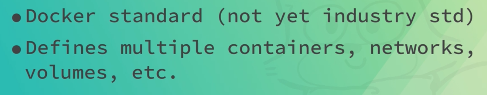
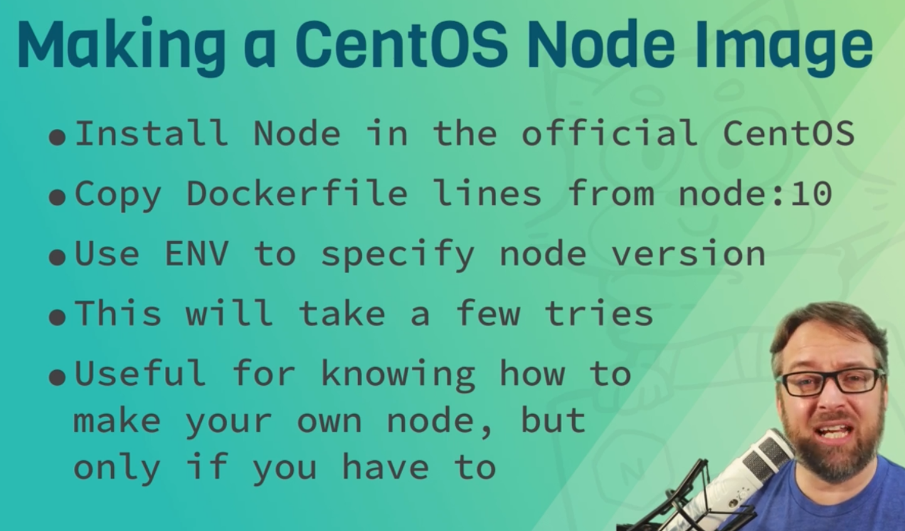

# DOCKER FOR NODE JS
- [DOCKER FOR NODE JS](#docker-for-node-js)
  - [Docker Compose Basics](#docker-compose-basics)
    - [how to check the docker version](#how-to-check-the-docker-version)
      - [docker version](#docker-version)
      - [docker compose version](#docker-compose-version)
    - [why compose](#why-compose)
      - [typical node server using a docker command](#typical-node-server-using-a-docker-command)
    - [compose file format](#compose-file-format)
      - [YAML](#yaml)
    - [docker compose CLI](#docker-compose-cli)
    - [Assignment](#assignment)
  - [Node Dockerfile Best Practice Basics](#node-dockerfile-best-practice-basics)
    - [Section Intro Dockerfile Best Practice Basics](#section-intro-dockerfile-best-practice-basics)
    - [Dockerfile Best Practice Basics](#dockerfile-best-practice-basics)
    - [FROM Base Image Guidelines](#from-base-image-guidelines)
    - [When To Use Alpine, Debian, or CentOS Images](#when-to-use-alpine-debian-or-centos-images)
    - [Assignment Making a CentOS Node Image](#assignment-making-a-centos-node-image)
    - [Assignment Answers Making a CentOS Node Image](#assignment-answers-making-a-centos-node-image)
    - [Running Non-root Container Users](#running-non-root-container-users)
    - [Working With The Node User Limits](#working-with-the-node-user-limits)
    - [Making Images Efficiently](#making-images-efficiently)
  - [Controlling The Node Process In Containers](#controlling-the-node-process-in-containers)
    - [Section Intro Controlling The Node Process](#section-intro-controlling-the-node-process)
    - [Node Process Management](#node-process-management)
    - [The Truth About the PID 1 Problem](#the-truth-about-the-pid-1-problem)
    - [Proper Node Shutdown Options](#proper-node-shutdown-options)
    - [Assignment Writing Node Dockerfiles](#assignment-writing-node-dockerfiles)
    - [Assignment Answers Writing Node Dockerfiles](#assignment-answers-writing-node-dockerfiles)
    - [Assignment Testing Graceful Shutdowns](#assignment-testing-graceful-shutdowns)
    - [Assignment Answers Testing Graceful Shutdowns](#assignment-answers-testing-graceful-shutdowns)
  - [Advanced Dockerfiles with Multi-stage and BuildKit 🔲](#advanced-dockerfiles-with-multi-stage-and-buildkit-)
    - [001 Section Intro Advanced Node Dockerfiles 🔲](#001-section-intro-advanced-node-dockerfiles-)
    - [002 Multi-stage Docker Builds 🔲](#002-multi-stage-docker-builds-)
    - [003 More Multi-stage Uses 🔲](#003-more-multi-stage-uses-)
    - [004 Assignment Building A 3-Stage Dockerfile 🔲](#004-assignment-building-a-3-stage-dockerfile-)
    - [005 Assignment Answers Building a 3-Stage Dockerfile 🔲](#005-assignment-answers-building-a-3-stage-dockerfile-)
  - [Node Apps in Cloud Native Docker 🔲](#node-apps-in-cloud-native-docker-)
  - [Compose for Awesome Local Development 🔲](#compose-for-awesome-local-development-)
  - [Making Container Images Production Ready 🔲](#making-container-images-production-ready-)
  - [Running Production Node.js Containers 🔲](#running-production-nodejs-containers-)
  - [Running Node.js on ARM with Docker 🔲](#running-nodejs-on-arm-with-docker-)

## Docker Compose Basics

### how to check the docker version

#### docker version
```bash
🐋 -> docker --version
```

#### docker compose version
```bash
🐋 -> docker-compose --version
```

### why compose


#### typical node server using a docker command


typing this command every time is not a good idea.

recommended way is to use docker compose

cli is node designed to run on production this is when orchestration comes in.

- docker swarm
- kubernetes

### compose file format



default `docker-compose.yml` file for docker-compose but we can use any file name with `-f` flag

```bash
🐋 -> docker-compose -f ["your file name"].yml up
```
#### YAML


: for key/value pair
- for array


let's see a sample compose file

```yaml
version: '2.0'

services:
  web:
    image: sample-01
    build: .
    ports:
      - "3000:3000"
```


- version: version of compose file


### docker compose CLI


`docker-compose up`


to run the container in background

```bash
🐋 -> docker-compose up -d
```


### Assignment


```bash
# start the server
🐋 -> docker-compose up
# stop the server
🐋 -> docker-compose down
# start the server in background
🐋 -> docker-compose down
# check the status of the containers
🐋 -> docker-compose up -d
# check the status of the containers
🐋 -> docker-compose ps
# check the logs of the containers
🐋 -> docker-compose logs
```
```bash
> docker-compose up   
[+] Running 1/1
 ! web Warning                                                                                                                                                                                  7.1s 
[+] Building 141.4s (11/11) FINISHED                                                                                                                                                            docker:default
 => [web internal] load build definition from Dockerfile                                                                                                                                                  0.1s
 => => transferring dockerfile: 232B                                                                                                                                                                      0.0s
 => [web internal] load .dockerignore                                                                                                                                                                     0.1s
 => => transferring context: 455B                                                                                                                                                                         0.0s
 => [web internal] load metadata for docker.io/library/node:10-alpine                                                                                                                                     6.4s
 => [web auth] library/node:pull token for registry-1.docker.io                                                                                                                                           0.0s
 => [web 1/5] FROM docker.io/library/node:10-alpine@sha256:dc98dac24efd4254f75976c40bce46944697a110d06ce7fa47e7268470cf2e28                                                                              85.8s
 => => resolve docker.io/library/node:10-alpine@sha256:dc98dac24efd4254f75976c40bce46944697a110d06ce7fa47e7268470cf2e28                                                                                   0.1s
 => => sha256:dc98dac24efd4254f75976c40bce46944697a110d06ce7fa47e7268470cf2e28 1.65kB / 1.65kB                                                                                                            0.0s
 => => sha256:02767d92553e465bf51e0bd661074f2e70bd575c4a69a0d610aa6e78fd20a9bf 1.16kB / 1.16kB                                                                                                            0.0s
 => => sha256:aa67ba258e1877ed6ec455a7f4cc69e25cf0f0b027a7f6f3c63a8eca2c8a440c 6.73kB / 6.73kB                                                                                                            0.0s
 => => sha256:ddad3d7c1e96adf9153f8921a7c9790f880a390163df453be1566e9ef0d546e0 2.82MB / 2.82MB                                                                                                           18.8s
 => => sha256:de915e575d22c7e33c83fddaf7aee0672e5d6a67e598a26fe0b30c7022f53cdd 22.21MB / 22.21MB                                                                                                         81.9s
 => => sha256:7150aa69525b95f82b3df6a61a002f82382b2f3ea8ce51b9000b965f7476a5cc 2.35MB / 2.35MB                                                                                                           10.3s
 => => sha256:d7aa47be044e5a988e3e7f204e2e28cb9f070daa32ed081072ad6d5bf6c085d1 280B / 280B                                                                                                               15.1s
 => => extracting sha256:ddad3d7c1e96adf9153f8921a7c9790f880a390163df453be1566e9ef0d546e0                                                                                                                 0.2s
 => => extracting sha256:de915e575d22c7e33c83fddaf7aee0672e5d6a67e598a26fe0b30c7022f53cdd                                                                                                                 3.2s
 => => extracting sha256:7150aa69525b95f82b3df6a61a002f82382b2f3ea8ce51b9000b965f7476a5cc                                                                                                                 0.1s
 => => extracting sha256:d7aa47be044e5a988e3e7f204e2e28cb9f070daa32ed081072ad6d5bf6c085d1                                                                                                                 0.0s
 => [web internal] load build context                                                                                                                                                                     0.6s
 => => transferring context: 15.15MB                                                                                                                                                                      0.5s
 => [web 2/5] WORKDIR /usr/src/app                                                                                                                                                                        0.2s
 => [web 3/5] COPY package.json package-lock.json* ./                                                                                                                                                     0.1s
 => [web 4/5] RUN npm install && npm cache clean --force                                                                                                                                                 45.7s
 => [web 5/5] COPY . .                                                                                                                                                                                    0.1s
 => [web] exporting to image                                                                                                                                                                              1.9s
 => => exporting layers                                                                                                                                                                                   1.7s
 => => writing image sha256:0120acb63c9452adb5287b86f42db7dbdabd3aba26f71d4e6bc4ab3f66d79d09                                                                                                              0.1s
 => => naming to docker.io/library/sample-02                                                                                                                                                              0.1s
[+] Running 2/2
 ✔ Network sample-02_default  Created                                                                                                                                                                     0.5s 
 ✔ Container sample-02-web-1  Created                                                                                                                                                                     1.1s 
Attaching to sample-02-web-1
sample-02-web-1  | GET / 200 63.908 ms - 299
sample-02-web-1  | GET /stylesheets/style.css 200 6.647 ms - 119
sample-02-web-1  | GET /images/picard7.gif 200 1.049 ms - 4572535
sample-02-web-1  | GET /favicon.ico 404 11.558 ms - 983
sample-02-web-1  | GET /mockServiceWorker.js 404 4.645 ms - 983
sample-02-web-1  | GET / 200 6.015 ms - 299
sample-02-web-1  | GET /stylesheets/style.css 304 0.786 ms - -
sample-02-web-1  | GET /images/picard8.gif 200 1.016 ms - 1696869
sample-02-web-1  | GET /mockServiceWorker.js 404 5.021 ms - 983
sample-02-web-1  | GET / 200 4.679 ms - 299
sample-02-web-1  | GET /stylesheets/style.css 304 0.680 ms - -
sample-02-web-1  | GET /images/picard5.gif 200 0.983 ms - 1078088
sample-02-web-1  | GET /mockServiceWorker.js 404 8.134 ms - 983
sample-02-web-1  | GET / 200 3.270 ms - 299
sample-02-web-1  | GET /stylesheets/style.css 304 0.466 ms - -
sample-02-web-1  | GET /images/picard3.gif 200 0.936 ms - 961196
sample-02-web-1  | GET /mockServiceWorker.js 404 3.814 ms - 983
sample-02-web-1  | GET / 200 3.137 ms - 299
sample-02-web-1  | GET /stylesheets/style.css 304 1.002 ms - -
sample-02-web-1  | GET /images/picard0.gif 200 1.277 ms - 2328735
sample-02-web-1  | GET /mockServiceWorker.js 404 8.136 ms - 983
sample-02-web-1  | GET / 200 2.739 ms - 299
sample-02-web-1  | GET /stylesheets/style.css 304 0.597 ms - -
sample-02-web-1  | GET /images/picard6.gif 200 1.145 ms - 899094
sample-02-web-1  | GET /mockServiceWorker.js 404 3.102 ms - 983
sample-02-web-1  | GET / 304 6.149 ms - -
sample-02-web-1  | GET /stylesheets/style.css 304 0.629 ms - -
sample-02-web-1  | GET /images/picard6.gif 304 1.047 ms - -
sample-02-web-1  | GET /mockServiceWorker.js 404 3.958 ms - 983
sample-02-web-1  | GET / 200 3.557 ms - 299
sample-02-web-1  | GET /stylesheets/style.css 304 0.500 ms - -
sample-02-web-1  | GET /images/picard0.gif 304 0.443 ms - -
sample-02-web-1  | GET / 200 4.231 ms - 299
sample-02-web-1  | GET /stylesheets/style.css 304 0.668 ms - -
sample-02-web-1  | GET /images/picard3.gif 304 0.586 ms - -
sample-02-web-1  | GET /mockServiceWorker.js 404 3.425 ms - 983
sample-02-web-1  | GET / 200 3.810 ms - 299
sample-02-web-1  | GET /stylesheets/style.css 304 0.559 ms - -
sample-02-web-1  | GET /images/picard1.gif 200 1.492 ms - 417700
sample-02-web-1  | GET /mockServiceWorker.js 404 8.117 ms - 983
sample-02-web-1  | GET / 200 4.432 ms - 299
sample-02-web-1  | GET /stylesheets/style.css 304 0.419 ms - -
sample-02-web-1  | GET /images/picard0.gif 304 0.387 ms - -
sample-02-web-1  | GET / 200 2.572 ms - 299
sample-02-web-1  | GET /stylesheets/style.css 304 0.393 ms - -
sample-02-web-1  | GET /images/picard8.gif 304 0.621 ms - -
sample-02-web-1  | GET / 304 4.445 ms - -
sample-02-web-1  | GET /stylesheets/style.css 304 0.358 ms - -
sample-02-web-1  | GET /images/picard8.gif 304 0.480 ms - -
sample-02-web-1  | GET / 200 4.526 ms - 299
sample-02-web-1  | GET /mockServiceWorker.js 404 7.427 ms - 983
sample-02-web-1  | GET /stylesheets/style.css 304 0.525 ms - -
sample-02-web-1  | GET /images/picard1.gif 304 0.585 ms - -
sample-02-web-1  | GET / 200 3.113 ms - 299
sample-02-web-1  | GET /stylesheets/style.css 304 0.679 ms - -
sample-02-web-1  | GET /images/picard4.gif 200 0.937 ms - 368310
sample-02-web-1  | GET /mockServiceWorker.js 404 4.870 ms - 983
Gracefully stopping... (press Ctrl+C again to force)
Aborting on container exit...
[+] Stopping 1/1
 ✔ Container sample-02-web-1  Stopped                                                                                                                                                                     0.4s 
canceled
⬢  sample-02 ⚡ main ◉ 
> docker-compose down
[+] Running 2/2
 ✔ Container sample-02-web-1  Removed                                                                                                                                                                     0.0s 
 ✔ Network sample-02_default  Removed                                                                                                                                                                     0.3s 
⬢  sample-02 ⚡ main ◉ 
> docker-compose up -d
[+] Building 0.0s (0/0)                                                                                                                                                                         docker:default
[+] Running 2/2
 ✔ Network sample-02_default  Created                                                                                                                                                                     0.1s 
 ✔ Container sample-02-web-1  Started                                                                                                                                                                     0.1s 
⬢  sample-02 ⚡ main ◉ 
> docker-compose ps   
NAME              IMAGE       COMMAND                                 SERVICE   CREATED          STATUS          PORTS
sample-02-web-1   sample-02   "docker-entrypoint.sh node ./bin/www"   web       14 seconds ago   Up 13 seconds   0.0.0.0:3000->3000/tcp
⬢  sample-02 ⚡ main ◉ 
> docker-compose logs
⬢  sample-02 ⚡ main ◉ 
```


```shell
docker-compose exec web sh
> docker-compose exec web sh
/usr/src/app # ls
app.js             bin                node_modules       package-lock.json  package.json       public             routes             views
/usr/src/app # curl localhost
sh: curl: not found
/usr/src/app # sudo apt install curl
sh: sudo: not found
/usr/src/app # apt install curl
sh: apt: not found
/usr/src/app # exit

```
so curl is not installed 

let's add this to the docker file


updated docker file

```dockerfile
FROM node:10-alpine

EXPOSE 3000

WORKDIR /usr/src/app

COPY package.json package-lock.json* ./ 

RUN npm install && npm cache clean --force
RUN apk add --update curl
COPY . .

CMD [ "node", "./bin/www" ]

```

let's rerun the servi

```shell
docker-compose up -d
> docker-compose up -d
[+] Building 0.0s (0/0)                                                                                                                                                                         docker:default
[+] Running 2/2
 ✔ Network sample-02_default  Created                                                                                                                                                                     0.0s 
 ✔ Container sample-02-web-1  Started                                                                                                                                                                     0.0s 

```
notice we didn't rebuild the images 

let's force docker to rebuild the image

```shell
docker-compose up -d --build
> docker-compose up -d --build
[+] Building 34.6s (12/12) FINISHED                                                                                                                                                             docker:default
 => [web internal] load .dockerignore                                                                                                                                                                     0.0s
 => => transferring context: 455B                                                                                                                                                                         0.0s 
 => [web internal] load build definition from Dockerfile                                                                                                                                                  0.0s 
 => => transferring dockerfile: 257B                                                                                                                                                                      0.0s 
 => [web internal] load metadata for docker.io/library/node:10-alpine                                                                                                                                    12.1s 
 => [web auth] library/node:pull token for registry-1.docker.io                                                                                                                                           0.0s
 => [web 1/6] FROM docker.io/library/node:10-alpine@sha256:dc98dac24efd4254f75976c40bce46944697a110d06ce7fa47e7268470cf2e28                                                                               0.0s
 => [web internal] load build context                                                                                                                                                                     0.0s 
 => => transferring context: 1.11kB                                                                                                                                                                       0.0s 
 => CACHED [web 2/6] WORKDIR /usr/src/app                                                                                                                                                                 0.0s
 => CACHED [web 3/6] COPY package.json package-lock.json* ./                                                                                                                                              0.0s 
 => CACHED [web 4/6] RUN npm install && npm cache clean --force                                                                                                                                           0.0s 
 => [web 5/6] RUN apk add --update curl                                                                                                                                                                  22.1s 
 => [web 6/6] COPY . .                                                                                                                                                                                    0.1s
 => [web] exporting to image                                                                                                                                                                              0.1s
 => => exporting layers                                                                                                                                                                                   0.1s 
 => => writing image sha256:9b107d56e599b8b2b39815e4f72c2adf441a79bbc6570ce0add72f9a55dcb78e                                                                                                              0.0s 
 => => naming to docker.io/library/sample-02                                                                                                                                                              0.0s 
[+] Running 1/1
 ✔ Container sample-02-web-1  Started                                                                                                                                                                     0.6s 

```

let's try agin

```shell
docker-compose exec web sh
> docker-compose exec web sh  
/usr/src/app # curl localhost
curl: (7) Failed to connect to localhost port 80 after 0 ms: Connection refused
/usr/src/app # curl http://localhost:3000
<!DOCTYPE html>
<html>
  <head>
    <title>Node.js Express App</title>
    <link rel='stylesheet' href='/stylesheets/style.css' />
  </head>
  <body>
    <h1>Node.js Express App</h1>
<p>It Worked!  Enjoy a random Captain's gif</p>


  </body>
</html>
/usr/src/app #
/usr/src/app # exit


```

now curl is installed and our command worked


logs output

```shell
docker-compose logs -f web
> docker-compose logs -f web 
sample-02-web-1  | GET / 200 79.012 ms - 299
sample-02-web-1  | GET /stylesheets/style.css 200 5.962 ms - 119
sample-02-web-1  | GET /images/picard8.gif 304 1.249 ms - -
sample-02-web-1  | GET /favicon.ico - - ms - -
sample-02-web-1  | GET /mockServiceWorker.js 404 3.310 ms - 983
sample-02-web-1  | GET / 200 3.355 ms - 299
sample-02-web-1  | GET /stylesheets/style.css 304 0.424 ms - -
sample-02-web-1  | GET /images/picard4.gif 304 0.642 ms - -
sample-02-web-1  | GET /mockServiceWorker.js 404 3.930 ms - 983
sample-02-web-1  | GET / 304 5.750 ms - -
sample-02-web-1  | GET /stylesheets/style.css 304 0.357 ms - -
sample-02-web-1  | GET /images/picard4.gif 304 0.443 ms - -
sample-02-web-1  | GET /mockServiceWorker.js 404 3.614 ms - 983
sample-02-web-1  | GET / 200 3.013 ms - 299
sample-02-web-1  | GET /stylesheets/style.css 304 0.463 ms - -
sample-02-web-1  | GET /images/picard3.gif 304 0.397 ms - -
sample-02-web-1  | GET /mockServiceWorker.js 404 3.129 ms - 983
sample-02-web-1  | GET / 200 2.982 ms - 299
sample-02-web-1  | GET /stylesheets/style.css 304 0.479 ms - -
sample-02-web-1  | GET /images/picard0.gif 304 0.629 ms - -
sample-02-web-1  | GET /mockServiceWorker.js 404 8.033 ms - 983
sample-02-web-1  | GET / 200 3.203 ms - 299
sample-02-web-1  | GET /stylesheets/style.css 304 0.602 ms - -
sample-02-web-1  | GET /images/picard8.gif 304 0.491 ms - -
sample-02-web-1  | GET /mockServiceWorker.js 404 3.768 ms - 983
sample-02-web-1  | GET / 200 5.160 ms - 299
sample-02-web-1  | GET /stylesheets/style.css 304 0.604 ms - -
sample-02-web-1  | GET /images/picard1.gif 304 0.686 ms - -
sample-02-web-1  | GET /mockServiceWorker.js 404 3.208 ms - 983
sample-02-web-1  | GET / 200 4.009 ms - 299
sample-02-web-1  | GET /stylesheets/style.css 304 0.434 ms - -
sample-02-web-1  | GET /images/picard8.gif 304 0.530 ms - -
sample-02-web-1  | GET /mockServiceWorker.js 404 3.368 ms - 983
canceled

```

do the cleanup 

```shell
docker-compose down --rmi local
> docker-compose down --rmi local       
[+] Running 3/3
 ✔ Container sample-02-web-1  Removed                                                                                                                                                                     0.3s 
 ✔ Image sample-02:latest     Removed                                                                                                                                                                     0.0s 
 ✔ Network sample-02_default  Removed                                                                                                                                                                     0.3s 

```

```shell
# this will remove the image files as well
🐋-> docker-compose down --rmi local
```
## Node Dockerfile Best Practice Basics
### Section Intro Dockerfile Best Practice Basics

### Dockerfile Best Practice Basics


### FROM Base Image Guidelines

### When To Use Alpine, Debian, or CentOS Images

### Assignment Making a CentOS Node Image 


### Assignment Answers Making a CentOS Node Image

```dockerfile
# this is an answer file for Assignment
# move it up a directory for it to work

FROM centos:centos7

RUN groupadd --gid 1000 node \
    && useradd --uid 1000 --gid node --shell /bin/bash --create-home node

# node install taken from official node image Dockerfile
ENV NODE_VERSION 10.15.1

RUN set -ex \
    && for key in \
    94AE36675C464D64BAFA68DD7434390BDBE9B9C5 \
    FD3A5288F042B6850C66B31F09FE44734EB7990E \
    71DCFD284A79C3B38668286BC97EC7A07EDE3FC1 \
    DD8F2338BAE7501E3DD5AC78C273792F7D83545D \
    C4F0DFFF4E8C1A8236409D08E73BC641CC11F4C8 \
    B9AE9905FFD7803F25714661B63B535A4C206CA9 \
    77984A986EBC2AA786BC0F66B01FBB92821C587A \
    8FCCA13FEF1D0C2E91008E09770F7A9A5AE15600 \
    4ED778F539E3634C779C87C6D7062848A1AB005C \
    A48C2BEE680E841632CD4E44F07496B3EB3C1762 \
    B9E2F5981AA6E0CD28160D9FF13993A75599653C \
    ; do \
    gpg --batch --keyserver hkp://p80.pool.sks-keyservers.net:80 --recv-keys "$key" || \
    gpg --batch --keyserver hkp://ipv4.pool.sks-keyservers.net --recv-keys "$key" || \
    gpg --batch --keyserver hkp://pgp.mit.edu:80 --recv-keys "$key" ; \
    done \
    && curl -fsSLO --compressed "https://nodejs.org/dist/v$NODE_VERSION/node-v$NODE_VERSION-linux-x64.tar.xz" \
    && curl -fsSLO --compressed "https://nodejs.org/dist/v$NODE_VERSION/SHASUMS256.txt.asc" \
    && gpg --batch --decrypt --output SHASUMS256.txt SHASUMS256.txt.asc \
    && grep " node-v$NODE_VERSION-linux-x64.tar.xz\$" SHASUMS256.txt | sha256sum -c - \
    && tar -xJf "node-v$NODE_VERSION-linux-x64.tar.xz" -C /usr/local --strip-components=1 --no-same-owner \
    && rm "node-v$NODE_VERSION-linux-x64.tar.xz" SHASUMS256.txt.asc SHASUMS256.txt \
    && ln -s /usr/local/bin/node /usr/local/bin/nodejs

CMD [ "node" ]

```
### Running Non-root Container Users


### Working With The Node User Limits

```dockerfile
FROM node:10-slim

EXPOSE 3000

WORKDIR /node

COPY package*.json ./

RUN mkdir app && chown -R node:node .
USER node
# RUn or ENtrypoint or CMD will use this user after this line
RUN npm install && npm cache clean --force

WORKDIR /node/app

COPY --chown=node:node . .
CMD ["node", "app.js"]

```

```shell
docker build -t usernode .
> docker build -t usernode .
[+] Building 67.2s (12/12) FINISHED                                                                                                                                   docker:default 
 => [internal] load .dockerignore                                                                                                                                               0.3s 
 => => transferring context: 62B                                                                                                                                                0.0s 
 => [internal] load build definition from Dockerfile                                                                                                                            0.5s 
 => => transferring dockerfile: 292B                                                                                                                                            0.0s 
 => [internal] load metadata for docker.io/library/node:10-slim                                                                                                                 6.4s 
 => [auth] library/node:pull token for registry-1.docker.io                                                                                                                     0.0s 
 => [1/6] FROM docker.io/library/node:10-slim@sha256:88932859e3d022d79161b99628c4c2c50e836437455e2d1b1a008d98367b10d6                                                          40.8s
 => => resolve docker.io/library/node:10-slim@sha256:88932859e3d022d79161b99628c4c2c50e836437455e2d1b1a008d98367b10d6                                                           0.8s
 => => sha256:88932859e3d022d79161b99628c4c2c50e836437455e2d1b1a008d98367b10d6 776B / 776B                                                                                      0.0s
 => => sha256:64c30c91d628d40eb8f772ee1477f78aff820e317e8afbc5160857ee804e4b70 1.37kB / 1.37kB                                                                                  0.0s
 => => sha256:6fbcbbb5c6032ce4013d4c736ffe54e0764c36fa14315ae54cb51f244e813c52 7.09kB / 7.09kB                                                                                  0.0s
 => => sha256:bc29352cb629712e7fbce7227a16b53308b541ef41e19122a04c15646756b176 21.91MB / 21.91MB                                                                               35.9s
 => => sha256:f698164f6049bead44aeb7590e88d3df323011c20f0cedbff3d86f62e4c9f184 4.17kB / 4.17kB                                                                                  2.0s
 => => sha256:62deabe7a6db312ed773ccd640cd7cfbf51c22bf466886345684558f1036e358 22.53MB / 22.53MB                                                                               30.8s
 => => sha256:85e84b4c858fae373ccdf48432de781210efb7fd75d9d801be9917577fe6ca09 2.93MB / 2.93MB                                                                                  6.2s
 => => sha256:ac72e4359589952a2e38fbe10287d792cbb57f2ec3cd1eb730e9bab685ac9754 295B / 295B                                                                                      6.8s
 => => extracting sha256:62deabe7a6db312ed773ccd640cd7cfbf51c22bf466886345684558f1036e358                                                                                       2.6s
 => => extracting sha256:f698164f6049bead44aeb7590e88d3df323011c20f0cedbff3d86f62e4c9f184                                                                                       0.0s 
 => => extracting sha256:bc29352cb629712e7fbce7227a16b53308b541ef41e19122a04c15646756b176                                                                                       3.3s 
 => => extracting sha256:85e84b4c858fae373ccdf48432de781210efb7fd75d9d801be9917577fe6ca09                                                                                       0.1s 
 => => extracting sha256:ac72e4359589952a2e38fbe10287d792cbb57f2ec3cd1eb730e9bab685ac9754                                                                                       0.0s 
 => [internal] load build context                                                                                                                                               1.3s 
 => => transferring context: 34.24kB                                                                                                                                            0.1s 
 => [2/6] WORKDIR /node                                                                                                                                                         0.3s 
 => [3/6] COPY package*.json ./                                                                                                                                                 0.1s 
 => [4/6] RUN npm install && npm cache clean --force                                                                                                                           16.7s 
 => [5/6] WORKDIR /node/app                                                                                                                                                     0.9s 
 => [6/6] COPY . .                                                                                                                                                              0.9s 
 => exporting to image                                                                                                                                                          0.3s 
 => => exporting layers                                                                                                                                                         0.3s 
 => => writing image sha256:507a0bb0af0807868b62aea798a38ec80008839a4c5943c2141417a5974c1620                                                                                    0.0s 
 => => naming to docker.io/library/usernode                                                                                                                                     0.0s 


docker run -it usernode bash
> docker run -it usernode bash
node@f1533c601de0:/node/app$ ls -al
total 68
drwxr-xr-x 1 root root  4096 Oct 23 08:27 .
drwxr-xr-x 1 root root  4096 Oct 23 08:28 ..
-rwxr-xr-x 1 root root    22 Oct 23 04:31 .dockerignore
-rwxr-xr-x 1 root root   253 Oct 23 08:25 Dockerfile
drwxr-xr-x 2 root root  4096 Oct 23 04:31 answer
-rwxr-xr-x 1 root root  1179 Oct 23 04:31 app.js
-rwxr-xr-x 1 root root   166 Oct 23 04:31 docker-compose.yml
-rwxr-xr-x 1 root root 31671 Oct 23 04:31 package-lock.json
-rwxr-xr-x 1 root root   338 Oct 23 04:31 package.json
node@f1533c601de0:/node/app$ cd ..
node@f1533c601de0:/node$ ls -al
total 52
drwxr-xr-x  1 root root  4096 Oct 23 08:28 .
drwxr-xr-x  1 root root  4096 Oct 23 08:31 ..
drwxr-xr-x  1 root root  4096 Oct 23 08:27 app
drwxr-xr-x 41 root root  4096 Oct 23 08:28 node_modules
-rwxr-xr-x  1 root root 25761 Oct 23 08:28 package-lock.json
-rwxr-xr-x  1 root root   338 Oct 23 04:31 package.json
node@f1533c601de0:/node$ exit
exit

docker build -t usernode .
> docker build -t usernode .  
[+] Building 30.4s (12/12) FINISHED                                                                                                                                   docker:default
 => [internal] load .dockerignore                                                                                                                                               0.0s
 => => transferring context: 62B                                                                                                                                                0.0s 
 => [internal] load build definition from Dockerfile                                                                                                                            0.0s 
 => => transferring dockerfile: 294B                                                                                                                                            0.0s 
 => [internal] load metadata for docker.io/library/node:10-slim                                                                                                                 3.3s 
 => [auth] library/node:pull token for registry-1.docker.io                                                                                                                     0.0s
 => CACHED [1/6] FROM docker.io/library/node:10-slim@sha256:88932859e3d022d79161b99628c4c2c50e836437455e2d1b1a008d98367b10d6                                                    0.0s
 => [internal] load build context                                                                                                                                               0.3s 
 => => transferring context: 527B                                                                                                                                               0.0s 
 => [2/6] WORKDIR /node                                                                                                                                                         1.0s 
 => [3/6] COPY package*.json ./                                                                                                                                                 0.9s
 => [4/6] RUN npm install && npm cache clean --force                                                                                                                           24.6s
 => [5/6] WORKDIR /node/app                                                                                                                                                     0.1s
 => [6/6] COPY . .                                                                                                                                                              0.0s
 => exporting to image                                                                                                                                                          0.2s
 => => exporting layers                                                                                                                                                         0.2s
 => => writing image sha256:6f1badf043add89e71a1992b181fd821f6f2853e5d118af266cf7eafc463f760                                                                                    0.0s
 => => naming to docker.io/library/usernode                                                                                                                                     0.0s
docker build -t usernode .
> docker build -t usernode .
[+] Building 13.3s (12/12) FINISHED                                                                                                                                   docker:default
 => [internal] load .dockerignore                                                                                                                                               0.0s
 => => transferring context: 62B                                                                                                                                                0.0s 
 => [internal] load build definition from Dockerfile                                                                                                                            0.0s 
 => => transferring dockerfile: 333B                                                                                                                                            0.0s 
 => [internal] load metadata for docker.io/library/node:10-slim                                                                                                                 3.5s 
 => [1/7] FROM docker.io/library/node:10-slim@sha256:88932859e3d022d79161b99628c4c2c50e836437455e2d1b1a008d98367b10d6                                                           0.0s
 => [internal] load build context                                                                                                                                               0.0s 
 => => transferring context: 566B                                                                                                                                               0.0s 
 => CACHED [2/7] WORKDIR /node                                                                                                                                                  0.0s 
 => CACHED [3/7] COPY package*.json ./                                                                                                                                          0.0s 
 => [4/7] RUN mkdir app && chown -R node:node .                                                                                                                                 0.4s 
 => [5/7] RUN npm install && npm cache clean --force                                                                                                                            8.9s
 => [6/7] WORKDIR /node/app                                                                                                                                                     0.1s
 => [7/7] COPY . .                                                                                                                                                              0.1s
 => exporting to image                                                                                                                                                          0.2s
 => => exporting layers                                                                                                                                                         0.2s
 => => writing image sha256:9c403f2e1fa01952b2908be9c2c2a67c866ec1c513c78aaaaadde2e3cd8a79cb                                                                                    0.0s
 => => naming to docker.io/library/usernode                                                                                                                                     0.0s
docker run -it usernode bash
node@95638b71234c:/node/app$ ls -al
total 68
drwxr-xr-x 1 node node  4096 Oct 23 08:39 .
drwxr-xr-x 1 node node  4096 Oct 23 08:37 ..
-rwxr-xr-x 1 node node    22 Oct 23 04:31 .dockerignore
-rwxr-xr-x 1 node node   312 Oct 23 08:38 Dockerfile
drwxr-xr-x 2 node node  4096 Oct 23 04:31 answer
-rwxr-xr-x 1 node node  1179 Oct 23 04:31 app.js
-rwxr-xr-x 1 node node   166 Oct 23 04:31 docker-compose.yml
-rwxr-xr-x 1 node node 31671 Oct 23 04:31 package-lock.json
-rwxr-xr-x 1 node node   338 Oct 23 04:31 package.json
node@95638b71234c:/node/app$ cd ..
node@95638b71234c:/node$ ls -al
total 52
drwxr-xr-x  1 node node  4096 Oct 23 08:37 .
drwxr-xr-x  1 root root  4096 Oct 23 08:39 ..
drwxr-xr-x  1 node node  4096 Oct 23 08:39 app
drwxr-xr-x 41 node node  4096 Oct 23 08:37 node_modules
-rwxr-xr-x  1 node node 25761 Oct 23 08:37 package-lock.json
-rwxr-xr-x  1 node node   338 Oct 23 04:31 package.json
```
### Making Images Efficiently


run the package command on a single command

do not do this


## Controlling The Node Process In Containers

### Section Intro Controlling The Node Process

### Node Process Management

### The Truth About the PID 1 Problem


### Proper Node Shutdown Options


### Assignment Writing Node Dockerfiles

### Assignment Answers Writing Node Dockerfiles
```dockerfile
FROM node:10.15.3-alpine

EXPOSE 3000

RUN apk add --no-cache tini

WORKDIR /app

COPY package.json package.lock*.json ./

RUN npm install && npm cache clean --force

COPY . .

ENTRYPOINT ["/sbin/tini","--"]

CMD ["node","app.js"]

```

```shell
docker build -t sample-app .
> docker build -t sample-app .
[+] Building 13.3s (12/12) FINISHED                                                                                           docker:default
 => [internal] load build definition from Dockerfile                                                                                    0.0s
 => => transferring dockerfile: 336B                                                                                                    0.0s 
 => [internal] load .dockerignore                                                                                                       0.0s 
 => => transferring context: 2B                                                                                                         0.0s 
 => [internal] load metadata for docker.io/library/node:10.15.3-alpine                                                                  2.5s 
 => [auth] library/node:pull token for registry-1.docker.io                                                                             0.0s
 => [1/6] FROM docker.io/library/node:10.15.3-alpine@sha256:aa28f3b6b4087b3f289bebaca8d3fb82b93137ae739aa67df3a04892d521958e            0.0s
 => [internal] load build context                                                                                                       0.0s 
 => => transferring context: 495B                                                                                                       0.0s 
 => CACHED [2/6] RUN apk add --no-cache tini                                                                                            0.0s 
 => [3/6] WORKDIR /app                                                                                                                  0.1s 
 => [4/6] COPY package.json package.lock*.json ./                                                                                       0.1s
 => [5/6] RUN npm install && npm cache clean --force                                                                                   10.2s 
 => [6/6] COPY . .                                                                                                                      0.1s
 => exporting to image                                                                                                                  0.2s 
 => => exporting layers                                                                                                                 0.2s
 => => writing image sha256:5c13d72ed0de5644ceb0cee2adad110a93880db4a0fbe35b25bc9e8b7a7ac630                                            0.0s
 => => naming to docker.io/library/sample-app                                                                                           0.0s

What's Next?
  View a summary of image vulnerabilities and recommendations → docker scout quickview


```

output
```shell
docker run sample-app
> docker run sample-app       
[1698068180003] INFO  (7 on 4d2c92e1eee5): server started
    created: 1698068179946
    started: 1698068179994
    host: "0.0.0.0"
    port: 3000
    protocol: "http"
    id: "4d2c92e1eee5:7:lo2xy962"
    uri: "http://0.0.0.0:3000"
    address: "0.0.0.0"
Server running at: http://0.0.0.0:3000

```
### Assignment Testing Graceful Shutdowns

bonus

### Assignment Answers Testing Graceful Shutdowns
remove the tini from the docker file

```dockerfile
# fill in the blanks to dockerize this node app
FROM node:10.15.3-alpine

EXPOSE 3000

# RUN apk add --no-cache tini

WORKDIR /app

COPY package.json package.lock*.json ./

RUN npm install && npm cache clean --force

COPY . .

# ENTRYPOINT ["/sbin/tini","--"]

CMD ["node","app.js"]
```

we can use the --init flag to use tini

```shell
docker run --init -p 3000:3000 sample-app-1
```

## Advanced Dockerfiles with Multi-stage and BuildKit 🔲
### 001 Section Intro Advanced Node Dockerfiles 🔲
### 002 Multi-stage Docker Builds 🔲
### 003 More Multi-stage Uses 🔲
### 004 Assignment Building A 3-Stage Dockerfile 🔲
### 005 Assignment Answers Building a 3-Stage Dockerfile 🔲

## Node Apps in Cloud Native Docker 🔲
## Compose for Awesome Local Development 🔲
## Making Container Images Production Ready 🔲
## Running Production Node.js Containers 🔲
## Running Node.js on ARM with Docker 🔲
